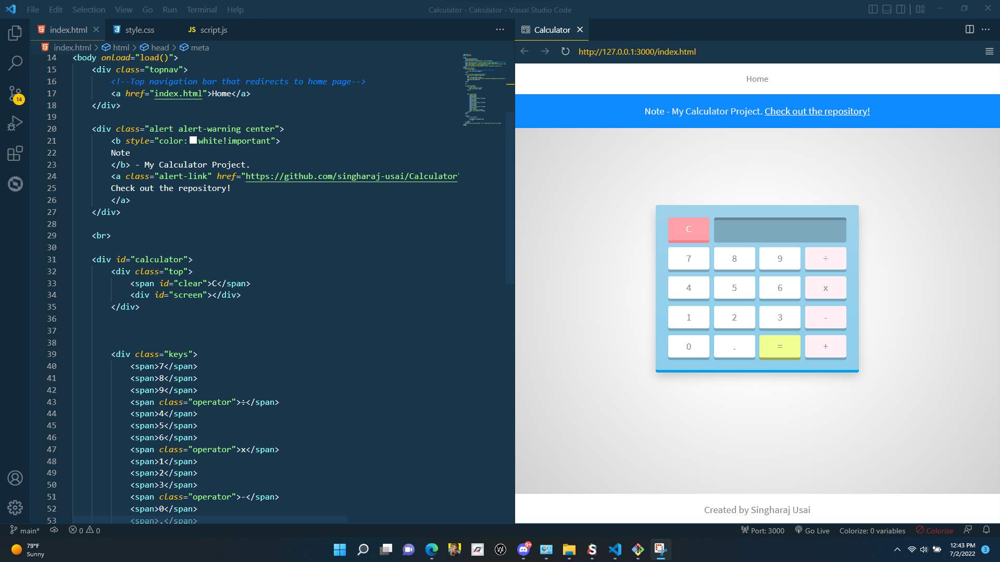

# Javascript Calculator

## Index
1. [Overview](#overview)
    - [Summary](#summary)
    - [Links](#links)
    - [Screenshots](#screenshots)
    - [Made with](#made-with)

# Overview

🖩 A simple static calculator that is powered by Javascript using key inputs.

## Summary

Users can input keys by pressing buttons on a calculator to output values. An HTML/CSS powered by Javascript to create a simple calculator.

## Links

Live Site URL: https://singharaj-usai.github.io/Javascript-Calculator/

Repository URL: https://github.com/singharaj-usai/Javascript-Calculator

## Screenshots
* Calculator
    * You are shown a number of keypads that you can press which inputs strings into the inputScreen, and when pressing the equal button, eval() outputs the statement.

## Made With

* HTML5
* CSS
* JavaScript
